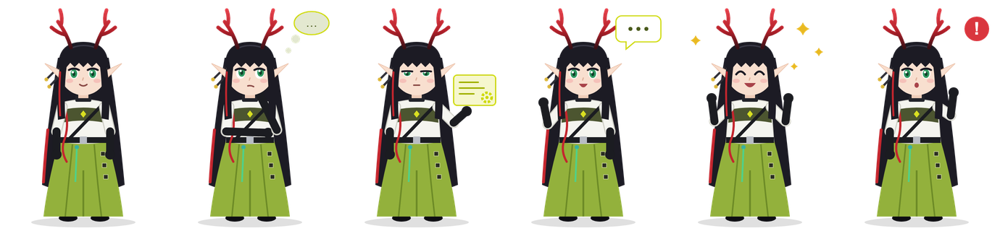
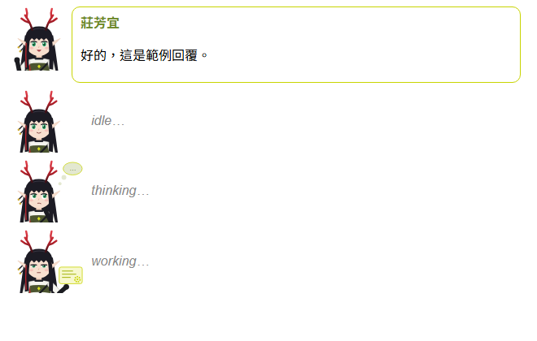
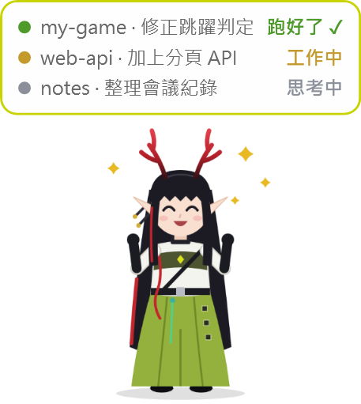
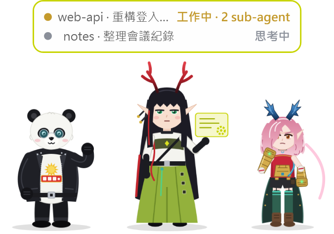

# fangyi-pet

讓《明日方舟：終末地》的莊芳宜（Q 版二創）陪你用 Claude Code：

- **對話裡**：Claude 的每則回覆由她用對話泡泡說出來；處理中時，輸入框上方會出現她的姿勢和大字狀態（思考中… / 工作中… / 等你確認…）。
- **sub-agent**：有 sub-agent 在跑時，熊貓和弭弗會跟著她一起出來，熊貓在左、弭弗在右。
- **桌面上（Windows）**：桌寵顯示每個 Claude Code session 在做什麼，session 跑完時她會歡呼並響一聲，讓你知道該回去看了。



| 對話泡泡 | 桌寵 |
| --- | --- |
|  |  |

## 安裝 mod

在 Claude Code 的終端機輸入：

```
/plugin install fangyi-pet --marketplace TsukuyomiZ/fangyi-pet
```

出現 `Add marketplace?` 時按 `y`，範圍選 user（預設），之後新開的 session 都會載入。

更新到最新版：

```
claude plugin update fangyi-pet
```

需要支援 mods（hooks 模組）的 Claude Code 版本；目前在 2.1.293 上測試過。

### 終端機（CLI）

在終端機裡一樣有對話泡泡和輸入框上方的狀態，人物改用頭像：

- 一般終端機（Windows Terminal、iTerm2 等支援全彩的）：手繪的 12×10 像素小頭像，用半格字元 ▀ 畫，佔 12 欄 × 5 行。
- kitty、Ghostty（支援 kitty 圖片協定）：直接顯示 PNG 頭像。
- 終端機高度不夠時，輸入框上方只顯示狀態文字。

## 桌寵（Windows）

桌寵是獨立的小程式，不會隨 mod 一起自動啟動。

1. 下載這個 repo（`git clone` 或 GitHub 的 Download ZIP），放在任何地方。
2. 雙擊 `desktop-pet/start-pet.vbs`，她會出現在螢幕右下角。不需要安裝其他東西，用的是 Windows 內建的 PowerShell。
3. 想開機自動出現：按 `Win + R` 輸入 `shell:startup`，把 `start-pet.vbs` 的捷徑放進去。

她會讀取 mod 寫在 `~/.claude/desktop-pet/sessions/` 的狀態檔，所以要先裝好 mod，桌寵才看得到 session。

### 狀態

| 泡泡顯示 | 什麼時候 | 她的姿勢 |
| --- | --- | --- |
| 思考中 | 送出訊息後、模型思考時 | 托下巴，頭上有思考雲 |
| 回答中 | 模型正在寫回覆 | 說話 |
| 工作中 | 正在執行工具 | 操作全息面板 |
| 等你確認 | 跳出權限詢問，或 Claude 問你問題 | 舉手，旁邊一個紅色「!」 |
| 跑好了 ✓ | 這一輪結束 | 雙手歡呼，旁邊有星星，同時響一聲 |

有 sub-agent 在跑時，熊貓和弭弗會站在她兩側，那個 session 的狀態後面也會加上「· N sub-agent」：



同時有好幾個 session 時，她的姿勢優先顯示最需要你處理的事：等你確認 → 跑好了 → 工作中 → 回答中 → 思考中。

### 操作

- **點她一下**：所有「跑好了」標為已看，從清單收起。
- **點清單的某一列**：只把那一個標為已看。
- **拖曳**：移動位置，下次啟動會記得。
- **右鍵**：全部標為已看，或關閉桌寵。

每個 session 在清單裡顯示為「資料夾名稱 · 你最後一句話的開頭」。

## 檔案

```
.claude-plugin/       plugin.json、marketplace.json
hooks/register.tsx    對話泡泡、處理中姿勢、回報 session 狀態
hooks/fangyi-svg.ts   莊芳宜的 SVG 繪圖（六種姿勢）與輸入框上方的狀態圖
hooks/companions-svg.ts  熊貓與弭弗的 SVG 繪圖
hooks/pixel-sprites.ts  終端機用的手繪像素頭像（直接改裡面的文字格就能改圖）
terminal-art/         kitty / Ghostty 用的 PNG 頭像
scripts/              重新產生 PNG 頭像：node scripts/render-art.mjs <暫存資料夾>，
                      再 py scripts/terminal_art.py <暫存資料夾>（需要 Edge 與 Pillow）
tests/                claude plugin test 的測試
desktop-pet/          桌寵：pet.ps1、start-pet.vbs、poses/*.png
```

## 說明

角色圖是依莊芳宜、熊貓、弭弗的造型重新繪製的非官方二創，角色版權屬於原作。
